# Agent Lens Architecture

## System Overview

Agent Lens is a judgment layer for AI coding agents (primarily OpenAI Codex). It sits between the agent and its execution environment, intercepting proposed tool calls, evaluating them through a pipeline of deterministic risk analysis and LLM-driven intelligence, then deciding whether to auto-execute, gate for human approval, or block outright. All decisions are recorded in an append-only audit ledger.

The system follows a local-first architecture: a Python/FastAPI backend runs as a local guard process, a Next.js/TypeScript frontend provides the session ledger and approval console, and multiple adapter paths let Codex connect through hooks, a WebSocket proxy, or a direct app-server bridge.

---

## High-Level System Diagram

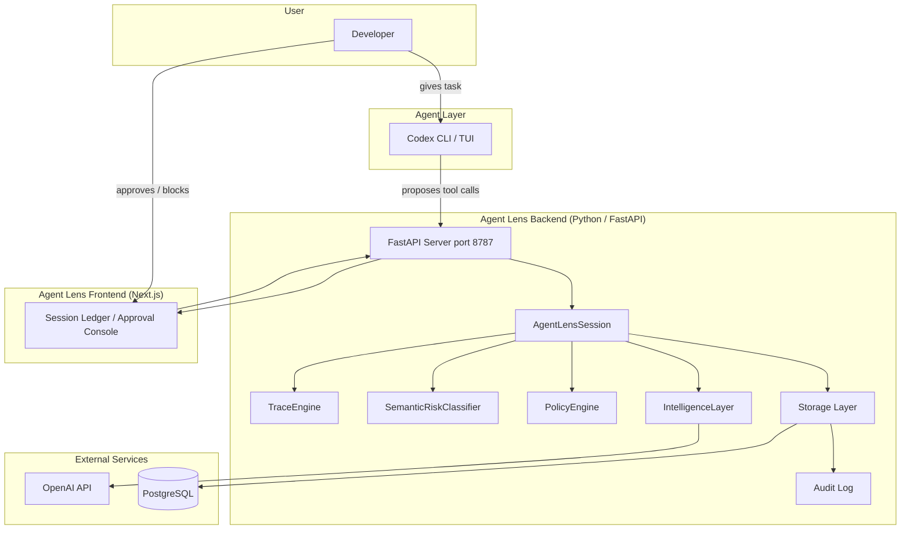

---

## Connection Paths

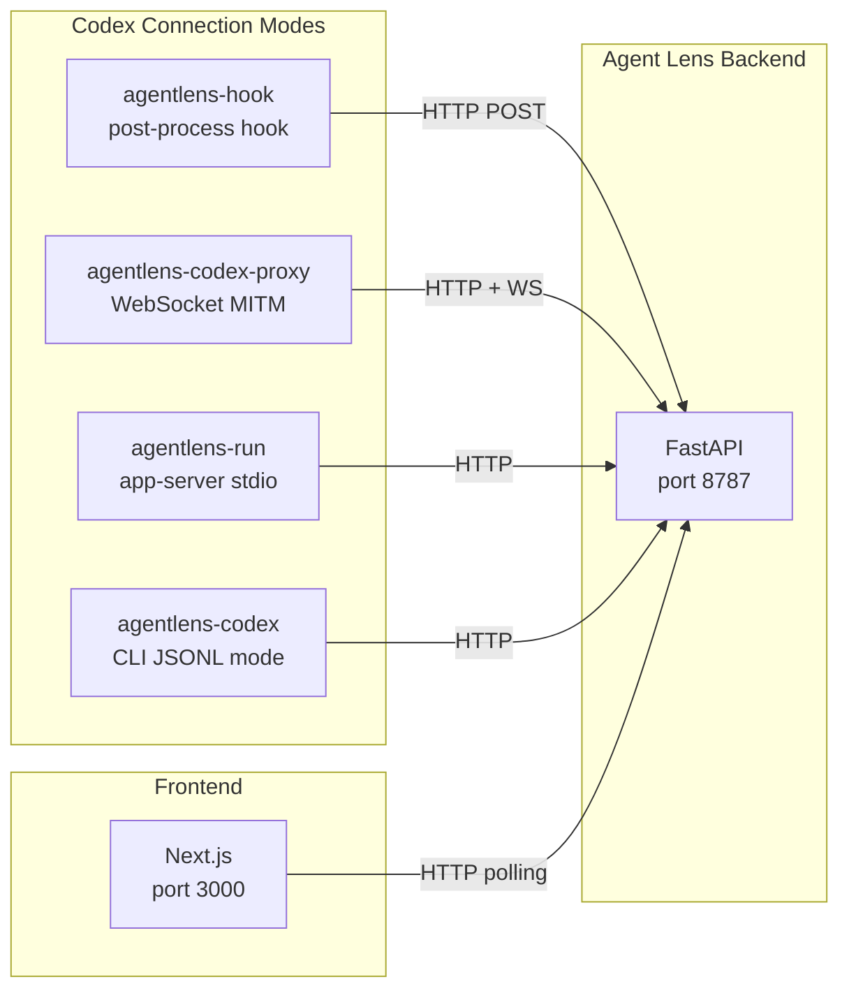

---

## Core Data Flow

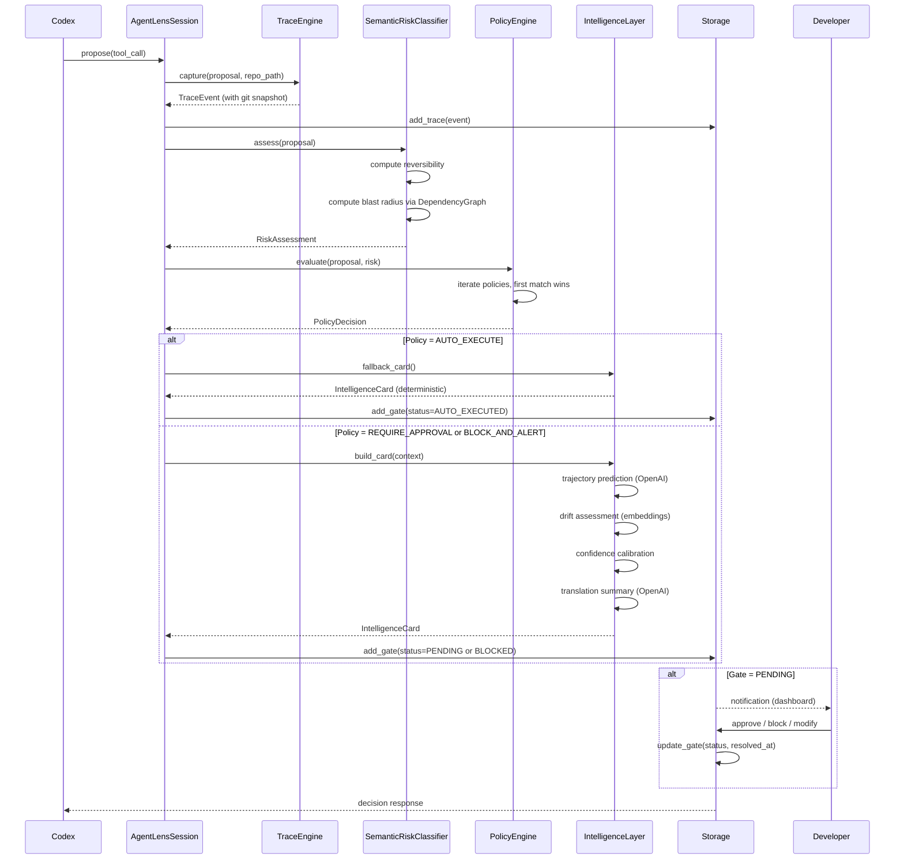

---

## Backend Component Architecture

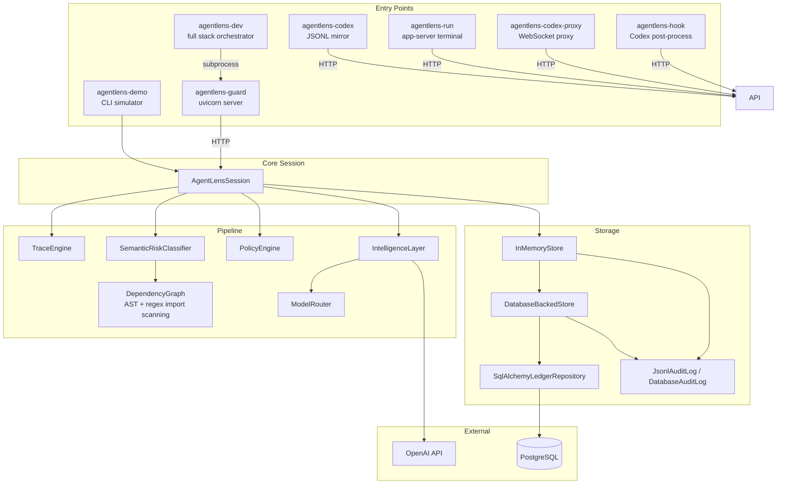

---

## Intelligence Pipeline

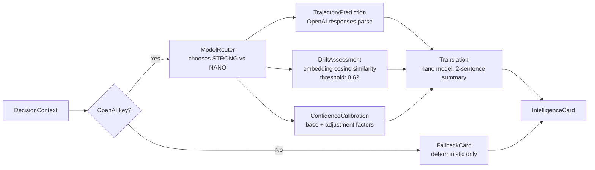

### Model Routing Logic

| Condition | Model Role |
|-----------|-----------|
| Policy action is not `auto_execute` | STRONG |
| Risk level is MEDIUM, HIGH, or CRITICAL | STRONG |
| Tool is `fs.write`, `fs.delete`, `api.call`, `db.query` | STRONG |
| Tool is `shell.run` | STRONG |
| All other cases | NANO |

For summaries: HIGH/CRITICAL risk uses STRONG, everything else uses NANO.

---

## Risk Classification

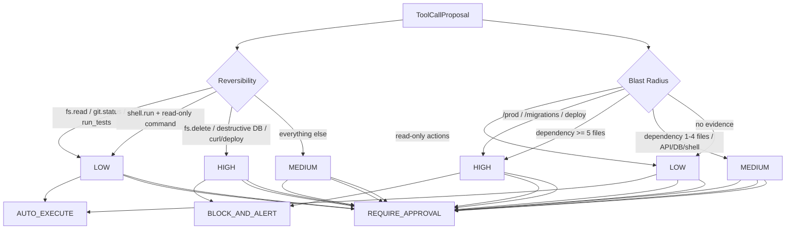

The blast radius computation uses `DependencyGraph`, which parses Python imports via AST and JavaScript/TypeScript imports via regex to build a map of which files import which modules. Config references (package.json, pyproject.toml, Dockerfile, README, etc.) are also scanned.

---

## Policy Evaluation Pipeline

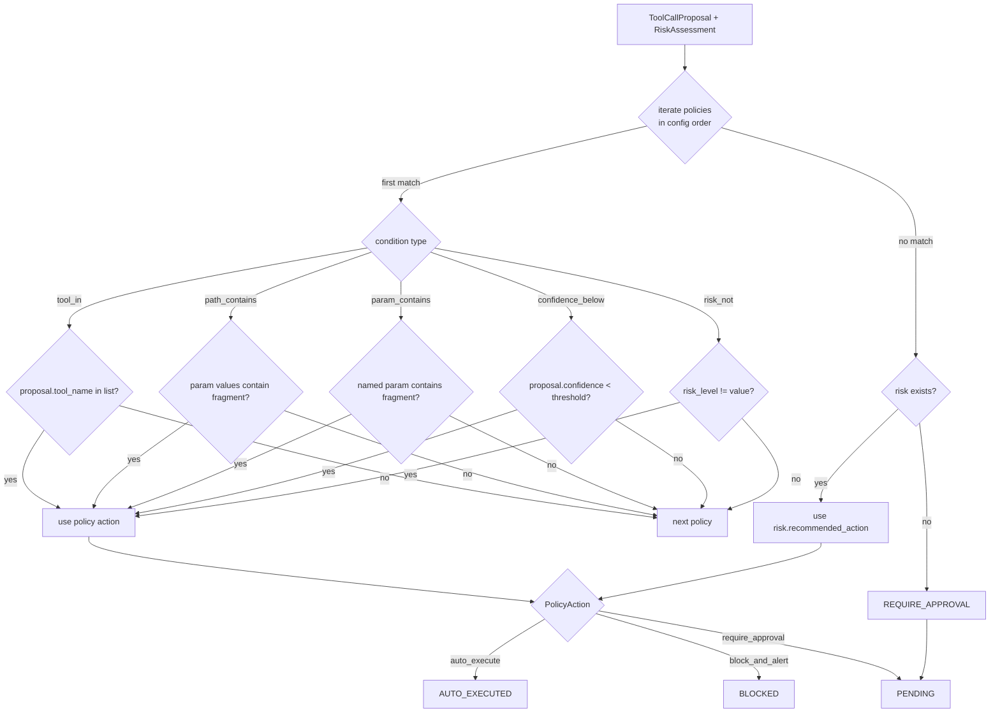

---

## Storage Layer

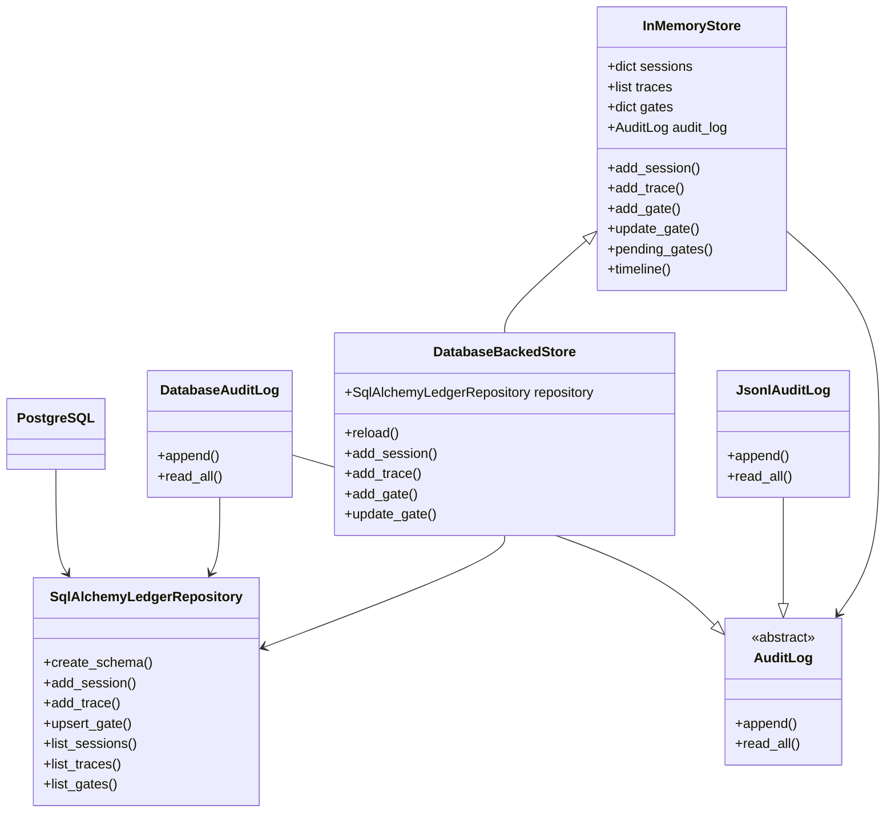

Storage is selected at startup based on `AGENTLENS_STORAGE_BACKEND`:
- `memory` (default): `InMemoryStore` with `JsonlAuditLog` writing to `local_data/agentlens_audit.jsonl`.
- `postgres`: `DatabaseBackedStore` which mirrors in-memory operations to PostgreSQL via `SqlAlchemyLedgerRepository`.

---

## Data Models

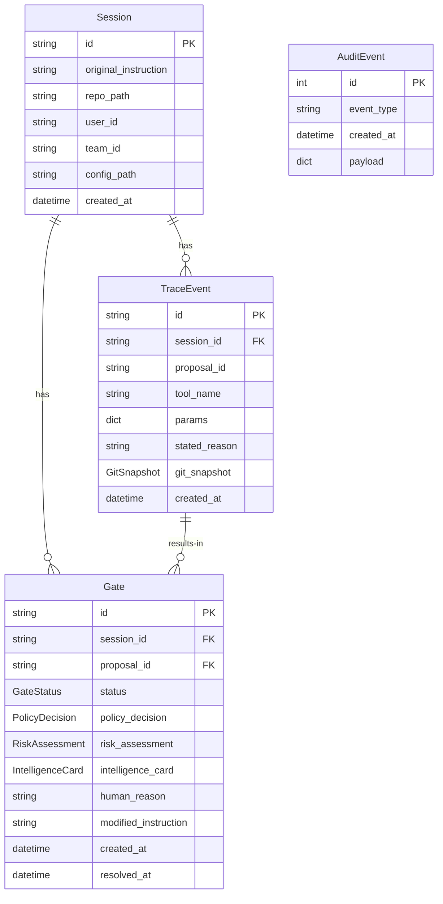

---

## API Routes

| Method | Path | Purpose |
|--------|------|---------|
| GET | `/health` | Health check |
| POST | `/sessions` | Create a new session |
| GET | `/sessions` | List sessions |
| GET | `/sessions/latest` | Get most recent session |
| GET | `/sessions/{id}/timeline` | Get traces + gates |
| GET | `/sessions/{id}/analytics` | Trust score, patterns, distributions |
| POST | `/sessions/{id}/tool-calls` | Submit a proposal, get a Gate |
| GET | `/gates/pending` | All pending gates |
| GET | `/gates/{id}` | Single gate |
| POST | `/gates/{id}/approve` | Approve |
| POST | `/gates/{id}/block` | Block |
| POST | `/gates/{id}/modify` | Modify with instruction |
| POST | `/gates/{id}/observe` | Mark auto-executed |
| POST | `/gates/{id}/explain` | Full explanation |
| POST | `/gates/{id}/questions` | Natural language Q&A |
| GET | `/policies` | Read policy config |
| PUT | `/policies` | Save policy config |
| POST | `/policies/test` | Test draft policies |
| GET | `/audit/events` | Recent audit events |

---

## Frontend Component Tree

```mermaid
graph TB
    subgraph "Next.js Single Page App (port 3000)"
        HOME[Home (page.tsx)]
        SHELL[AppShell]
        METRICS[MetricsStrip]

        subgraph "Views"
            REVIEW[ReviewLedger]
            FLOW[FlowMapView]
            TRAJ[TrajectoryView]
            POL[PolicyLedgerView]
            SLACK[SlackSurfaceView]
            AUDIT[AuditEventsView]
        end

        subgraph "Review Sub-components"
            GATE_TABLE[GateTable<br/>TanStack Table]
            INSPECTOR[GateInspector]
            TIMELINE[TimelineAnalyticsTabs]
            EXPLAIN[ExplainMorePanel]
            DEP_GRAPH[DependencyGraph<br/>React Flow mini-graph]
        end
    end

    subgraph "Libraries"
        TANSTACK[@tanstack/react-table]
        XYFLOW[@xyflow/react]
        RECHARTS[recharts]
        LUCIDE[lucide-react]
        TAILWIND[Tailwind CSS]
    end

    HOME --> SHELL
    SHELL --> METRICS
    HOME --> REVIEW
    HOME --> FLOW
    HOME --> TRAJ
    HOME --> POL
    HOME --> SLACK
    HOME --> AUDIT

    REVIEW --> GATE_TABLE
    REVIEW --> INSPECTOR
    REVIEW --> TIMELINE
    INSPECTOR --> EXPLAIN
    INSPECTOR --> DEP_GRAPH

    GATE_TABLE --> TANSTACK
    FLOW --> XYFLOW
    DEP_GRAPH --> XYFLOW
    TIMELINE --> RECHARTS
    SHELL --> LUCIDE
```

The frontend is a single-page Next.js 15 app with six client-side views toggled by a state variable. All state lives in the root `Home` component and is props-drilled to children.

### Frontend Views

| View | Component | Purpose |
|------|-----------|---------|
| review | `ReviewLedger` | Gate queue (TanStack Table) + Inspector with explain/trajectory/dependency views |
| flow | `FlowMapView` | React Flow directed graph of the session timeline |
| trajectory | `TrajectoryView` | Counterfactual trajectory cards per gate |
| policies | `PolicyLedgerView` | CRUD policy rules, test drafts, save to config |
| slack | `SlackSurfaceView` | Send pending gates to Slack channel |
| audit | `AuditEventsView` | Full session replay + analytics charts |

---

## Entry Points

| CLI Command | Module | Function | How It Works |
|-------------|--------|----------|-------------|
| `agentlens-guard` | `guard.py` | Starts FastAPI on port 8787 | Local-first API server. All other entry points talk to this via HTTP. |
| `agentlens-demo` | `cli.py` | Creates session with fixture/default proposals | CLI simulator for testing without Codex. |
| `agentlens-hook` | `codex_hook.py` | Codex post-processing hook | Reads JSON from stdin, creates/updates sessions, posts proposals, polls for decisions, exits 2 if blocked. |
| `agentlens-codex` | `codex_terminal.py` | Runs Codex CLI in JSONL mode | Mirrors parsed Codex events into Agent Lens API, prints readable terminal output. |
| `agentlens-run` | `app_server_terminal.py` | Interactive/prompt mode via app-server | Spawns `codex app-server --stdio`, handles JSON-RPC approval callbacks, waits for human decisions. |
| `agentlens-codex-proxy` | `codex_proxy.py` | WebSocket MITM proxy | Sits between Codex TUI and app-server, intercepts approval requests, enriches with Agent Lens intelligence. |
| `agentlens-dev` | `dev_stack.py` | One-command full stack | Spawns guard + frontend + proxy as subprocesses, optionally launches Codex. |

---

## Adapter Architecture

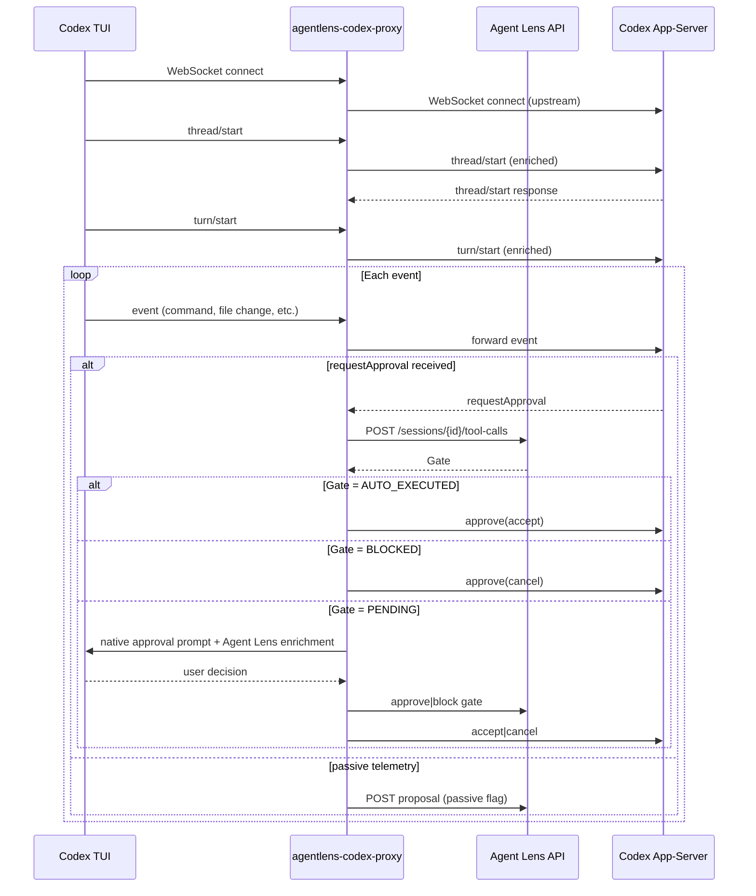

---

## Codex TUI to Agent Lens Perception Flow

This is the strict native TUI path. Codex keeps its normal terminal UI, but it is launched
with `--remote ws://127.0.0.1:8791`, so app-server traffic passes through
`agentlens-codex-proxy` before reaching the real Codex app-server.

```mermaid
flowchart LR
    subgraph TUI["Codex TUI"]
        USER_TASK[Developer prompt]
        NATIVE_UI[Native terminal UI]
        NATIVE_PROMPT[Native approval prompt]
    end

    subgraph PROXY["agentlens-codex-proxy"]
        WS[WebSocket bridge<br/>127.0.0.1:8791]
        ROUTER{Message type}
        NORMALIZE[Normalize Codex payload<br/>tool, target, cwd, reason]
        ENRICH[Inject Agent Lens summary<br/>risk, evidence, dashboard metadata]
    end

    subgraph RAW["Codex app-server messages"]
        START["thread/start + turn/start"]
        APPROVAL["item/commandExecution/requestApproval<br/>item/fileChange/requestApproval<br/>item/permissions/requestApproval"]
        TELEMETRY[Passive command/read telemetry]
    end

    subgraph AL["Agent Lens perception"]
        PROPOSAL[ToolCallProposal<br/>what Codex wants to do]
        TRACE[TraceEvent<br/>what was observed]
        CONTEXT[DecisionContext<br/>instruction + recent trace + git state]
        RISK[RiskAssessment<br/>reversibility + blast radius]
        POLICY[PolicyDecision<br/>standing rule or fallback]
        CARD[IntelligenceCard<br/>trajectory, drift, confidence, translation]
        GATE[Gate<br/>auto_executed, pending, blocked, approved]
        EPISODE[ReviewEpisode<br/>human-facing grouped action]
    end

    subgraph BACKEND["Agent Lens API + Ledger"]
        TOOLCALLS["POST /sessions/{id}/tool-calls"]
        OBSERVE["POST /gates/{id}/observe"]
        DECISION["POST /gates/{id}/approve<br/>POST /gates/{id}/block<br/>POST /gates/{id}/modify"]
        TIMELINE["GET /sessions/{id}/timeline"]
    end

    subgraph SERVER["Codex app-server"]
        EXECUTE[Execute accepted command<br/>or file change]
        CANCEL[Cancel rejected action]
    end

    subgraph LEDGER["Next.js ledger"]
        QUEUE[Review Queue]
        INSPECTOR[Inspector evidence]
        FLOW[Flow Map + Audit Events]
    end

    USER_TASK --> NATIVE_UI
    NATIVE_UI -->|WebSocket JSON-RPC| WS
    WS --> START
    WS --> APPROVAL
    WS --> TELEMETRY

    START -->|forward with approval policy + sandbox| SERVER
    APPROVAL --> ROUTER
    TELEMETRY --> ROUTER

    ROUTER -->|approval request| NORMALIZE
    ROUTER -->|already happened observation| NORMALIZE
    NORMALIZE --> PROPOSAL
    PROPOSAL --> TOOLCALLS
    TOOLCALLS --> TRACE
    TRACE --> CONTEXT
    CONTEXT --> RISK
    RISK --> POLICY
    POLICY --> CARD
    CARD --> GATE
    GATE --> EPISODE

    GATE -->|low risk| EXECUTE
    GATE -->|passive telemetry| OBSERVE
    OBSERVE --> EPISODE
    GATE -->|pending| ENRICH
    ENRICH --> NATIVE_PROMPT
    NATIVE_PROMPT -->|approve / cancel| DECISION
    DECISION -->|approved or modified| EXECUTE
    DECISION -->|blocked| CANCEL

    TIMELINE --> QUEUE
    TIMELINE --> INSPECTOR
    TIMELINE --> FLOW
    EPISODE --> TIMELINE
```

Agent Lens does not treat raw Codex traffic as final product truth. It perceives each
app-server approval or telemetry message as a typed `ToolCallProposal`, then enriches it
with repository state, policy matches, deterministic risk, and optional OpenAI-generated
trajectory/drift/confidence evidence. The ledger renders `ReviewEpisode` objects so the
operator sees meaningful actions such as "edit README" or "inspect backend routes" instead
of a stream of low-level JSON-RPC messages.

---

## Deployment Architecture

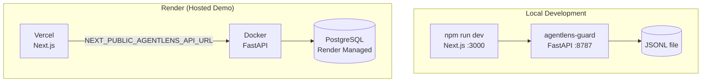

The default storage backend is in-memory with JSONL audit logging. PostgreSQL is used in hosted mode on Render. The frontend connects to the backend via the `NEXT_PUBLIC_AGENTLENS_API_URL` environment variable, overridable via a `?api=` query parameter.

---

## Key Design Decisions

1. **Local-first**: The guard runs as a local process on port 8787, keeping all data on the developer's machine by default. Hosted mode with PostgreSQL is available for demos and remote review.

2. **Append-only audit**: Every session start, trace capture, gate creation, and gate update is written to an append-only JSONL audit log (or PostgreSQL in hosted mode). The audit log cannot be modified retroactively -- only new events can be appended.

3. **Cost-aware model routing**: Strong models (gpt-4.1) are only called for consequential actions. Low-risk read-only actions use nano models or deterministic fallback. This keeps operational costs proportional to risk.

4. **Deterministic fallback**: When OpenAI credentials are not configured, the intelligence layer produces deterministic summaries from tool metadata and risk evidence. No LLM calls are required for the system to function.

5. **Thread-safe storage**: `InMemoryStore` uses `RLock` for thread safety. The `DatabaseBackedStore` mirrors to PostgreSQL using `run_blocking()` to bridge sync FastAPI handlers with async SQLAlchemy.

6. **Policy-first evaluation**: Policies are evaluated before intelligence calls. If a policy auto-executes an action, no LLM intelligence is generated -- only a lightweight deterministic card is created.

7. **No WebSockets in the frontend**: The frontend polls REST endpoints on intervals rather than using WebSockets. This simplifies the architecture and avoids connection management complexity for a local-first tool.

8. **Passive observation mode**: Codex hooks can run in mirror-only mode (`passive=true`), recording tool calls for dashboard visibility without blocking execution. This is the default for normal Codex TUI sessions.
